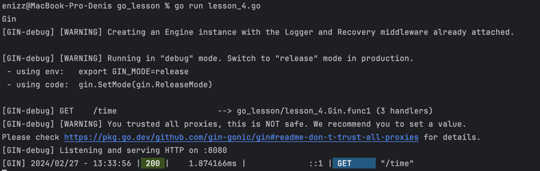
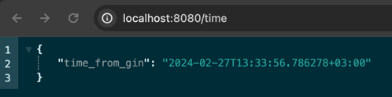
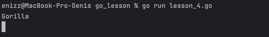
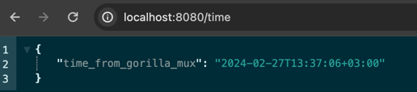
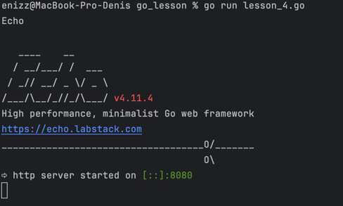
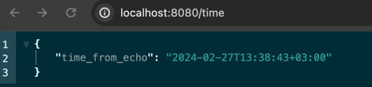

## Домашние задания по курсу [Go-разработчик](https://brunoyam.com/online-kursy/go)

**Запуск:**
`go run lesson_#.go`

### **Пример работы:**

#### Lesson_1

-------------
#### Lesson_2

-------------
#### Lesson_3

-------------
#### Lesson_4
Предварительно нужно установить фреймворки:

`go get github.com/gin-gonic/gin`

`github.com/gorilla/mux`

`github.com/labstack/echo/v4`

-------------

